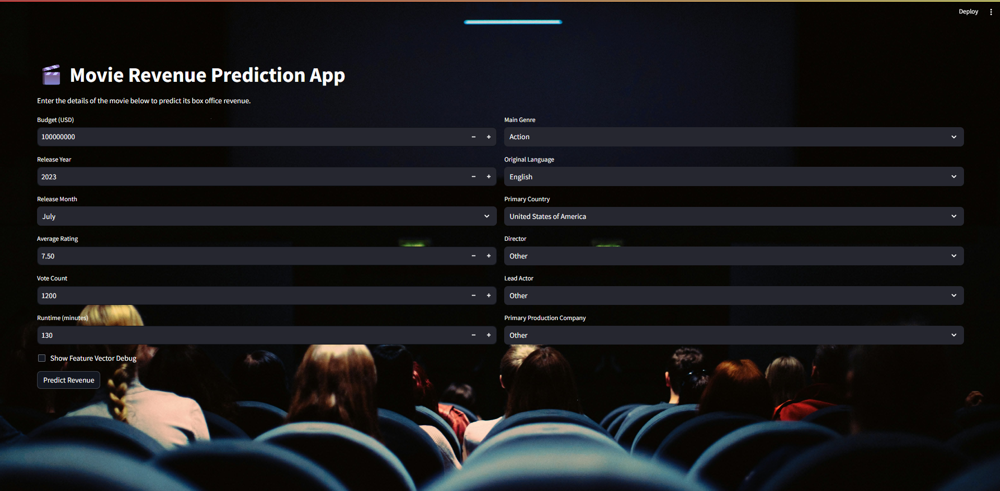
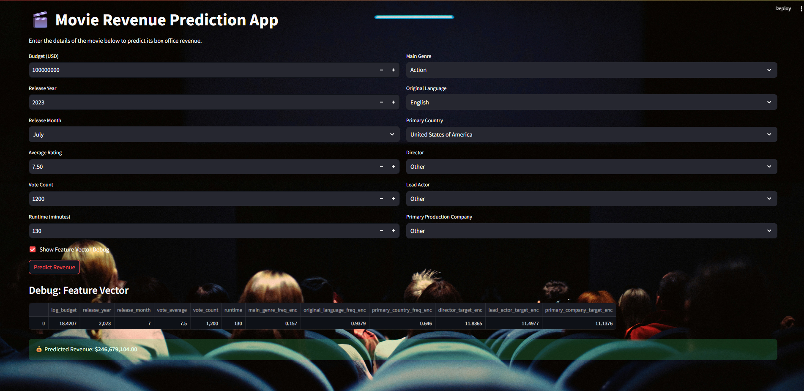

# 🎬 Box Office Revenue Prediction App

This project is a **machine learning-powered Streamlit web app** that predicts the **box office revenue** of a movie based on its metadata (budget, release date, genre, language, country, director, actors, etc.).

The model uses **XGBoost** trained on the **TMDB 5000 Movies Dataset** and integrates feature engineering techniques such as frequency encoding, target encoding, and log transformations.  

---

## 🚀 Live Demo
👉 [Try the App on Streamlit Cloud](https://streamlit.io/cloud) *(link will appear after deployment)*  

---

## 📸 Screenshots  

### App Home Page
  

### Prediction Example
  

*(Add your screenshots inside an `images/` folder in the repo)*  

---

## 📂 Project Structure

```bash
.
├── app.py                   # Streamlit app code
├── model.pkl                # Trained XGBoost model
├── freq_maps.pkl            # Frequency encoding mappings
├── target_maps.pkl          # Target encoding mappings
├── feature_order.pkl        # Feature order used in training
├── requirements.txt         # Python dependencies
├── images/                  # Screenshots
└── README.md                # Project documentation
---
```

## ⚙️ Features
- **Interactive UI** built with Streamlit  
- **Two-column layout** for cleaner input  
- **Wallpaper background** for better user experience  
- Accepts user inputs such as:  
  - 🎥 Budget, Release Year, Release Month  
  - ⭐ Vote Average, Vote Count  
  - ⏱️ Runtime  
  - 🎭 Main Genre, Language, Country  
  - 🎬 Director, Lead Actor, Production Company  
- **Outputs Predicted Revenue in USD** 💰  
- **Debug Mode**: Option to show the exact feature vector used for prediction  

---

## 🛠️ Installation

Clone the repository:
```bash
git clone https://github.com/yourusername/box-office-revenue-app.git
cd box-office-revenue-app
```

## Install dependencies:

```bash
pip install -r requirements.txt
```

## Run the Streamlit app locally:

```bash
streamlit run app.py
```
---

## 📊 Model
- **Algorithm:** Extreme Gradient Boosting (XGBoost)  
- **Target Variable:** Log-transformed revenue  
- **Evaluation:** The model was tested for predictive accuracy and robustness  

---

## 🚀 Deployment
The app can be deployed on **Streamlit Cloud**:

1. Push this repo to GitHub  
2. Go to [Streamlit Cloud](https://streamlit.io/cloud)  
3. Create a new app → point to `app.py`  
4. Deploy! 🎉  

---

## 📖 License
This project is licensed under the **MIT License**.  
